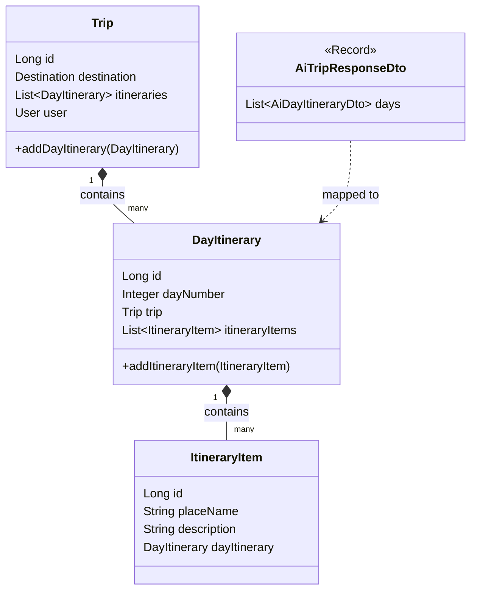

# Feature Implementation Report: Week 3 Trip Planner Gemini AI Integration

**Role:** Senior Technical Architect  
**Project:** Tripify Webapp  
**Date:** March 2026

---

### 1. High-Level Feature Overview
The primary objective of Week 3 was the implementation of a professional-grade AI Trip Generation system using the Google Gemini API. This feature allows users to input a destination, duration, and budget to receive a structured, multi-day itinerary.

**End-to-End Flow:**
1.  **Request:** User submits a `TripGenerationRequest` via the `TripController`.
2.  **Strategy:** The `TripServiceImpl` invokes the `AiTripGenerator` interface (Strategy Pattern).
3.  **AI Execution:** `GeminiTripGeneratorImpl` constructs a specialized prompt, calls the Gemini API via `RestTemplate`, and receives a JSON response.
4.  **Transformation:** The raw AI JSON is parsed into **Java Records (DTOs)** and then manually mapped into JPA entities.
5.  **Persistence:** The complete object tree (`Trip` -> `DayItinerary` -> `ItineraryItem`) is saved to the PostgreSQL database in a single transaction via JPA Cascading.

---

### 2. Knowledge Acquisition & Problem Solving
During implementation, several architectural hurdles were identified and resolved:

*   **Handling Bidirectional Recursion:** Initial attempts to parse JSON directly into JPA entities caused `StackOverflowError` or `InvalidDefinitionException` due to the circular relationship between `Trip` and `DayItinerary`.
    *   **Solution:** Implemented a **DTO-First Strategy**. AI data is parsed into flat Java Records, and bidirectional links are established manually during the mapping phase.
*   **AI "Hallucinations" in JSON:** LLMs sometimes return markdown formatting (e.g., ` ```json ` blocks) even when instructed otherwise.
    *   **Solution:** Implemented a robust "Clean JSON" utility using String manipulation before parsing with Jackson's `ObjectMapper`.
*   **Transaction Integrity:** Saving a multi-level hierarchy requires ensuring all parts succeed or all fail.
    *   **Solution:** Leveraged `@Transactional` and `CascadeType.ALL` to guarantee database atomicity.

---

### 3. Technical Implementation Detail

#### **Annotations**
*   **JPA:** `@Entity`, `@Table`, `@Id`, `@GeneratedValue`, `@OneToMany(mappedBy=...)`, `@ManyToOne`, `@JoinColumn`, `@Enumerated`, `@Transactional`.
*   **Lombok:** `@Data`, `@NoArgsConstructor`, `@AllArgsConstructor`, `@RequiredArgsConstructor`.
*   **Spring:** `@Service`, `@RestController`, `@RequestMapping`, `@PostMapping`, `@Value`, `@Bean`.

#### **Class Hierarchy & Relationships**



*   **`Trip` Entity:** The root aggregate. Responsible for metadata (user, destination, budget).
*   **`DayItinerary` Entity:** Middle-tier object representing a single day.
*   **`ItineraryItem` Entity:** The leaf object representing specific activities/locations.
*   **`AiTripResponseDto` (Record):** A lightweight, immutable "mailbox" for the AI's raw JSON output.

#### **JPA Deep Dive: Bidirectional Linking**
*   **Owning vs. Inverse Side:** In this system, `ItineraryItem` and `DayItinerary` are the owning sides of their respective relationships because they hold the Foreign Key column (e.g., `day_itinerary_id`).
*   **`mappedBy`:** Used on the parent side (`Trip`, `DayItinerary`) to indicate that the relationship is managed by the child's field name. This prevents the creation of unnecessary join tables.
*   **Data Integrity:** Custom helper methods (`addDayItinerary` and `addItineraryItem`) ensure that when a child is added to a parent's list, the child's back-reference to the parent is also set. This is critical for JPA to correctly persist the foreign keys.

---

### 4. Core Concepts & Patterns

#### **Two-Stage DTO Strategy (Google Gemini Integration)**
The integration with Google Gemini uses a two-stage parsing approach to handle the complex, nested response format of LLMs. This separation ensures that our internal business logic remains decoupled from the external API's structure.

**Stage 1: The External "Envelope" (`GeminiResponse.java`)**
The Google Gemini API returns a deeply nested JSON "envelope" containing metadata, candidates, and content parts. We use a traditional class with Lombok's `@Data` to map this structure:
*   **Structure:** `GeminiResponse` -> `List<Candidate>` -> `Content` -> `List<Part>` -> `String text`.
*   **Responsibility:** Its only job is to reach into the center of the "nesting doll" and extract the raw `text` string which contains the actual itinerary JSON.

**Stage 2: The Structured Payload (Java Records)**
Once we have the raw string, we parse it into a set of Java Records. These are used because they are immutable, lightweight, and require zero boilerplate.
*   **`AiTripResponseDto`:** The top-level payload containing a list of days.
*   **`AiDayItineraryDto`:** Represents a single day with its `dayNumber` and activities.
*   **`AiItineraryItemDto`:** Represents a specific activity with its `placeName`, `placeType`, and `description`.

**Why this approach is superior:**
1.  **Immutability:** Records ensure the AI data is a "snapshot" that cannot be accidentally modified during the mapping phase.
2.  **Decoupling:** If Google changes their API envelope (Stage 1), we only update one class. If we want to change our internal AI JSON format (Stage 2), we only update the records. Our database Entities remain untouched.
3.  **Zero Boilerplate:** Records automatically provide `equals()`, `hashCode()`, and `toString()`, making them perfect for data transfer and debugging.

#### **Security**
To prevent API key leakage, the system uses **Environment Variable Injection**.
*   The `application.properties` uses `${GEMINI_API_KEY}`.
*   Developers export the key via CLI (`export GEMINI_API_KEY=...`) or IntelliJ's Environment Variable settings. This ensures the key is never committed to GitHub.

#### **Testing Methodology**
*   **Unit Testing:** Implemented using `Mockito`. We "mock" the `AiTripGenerator` and `TripRepository` to test the service logic in 10ms without making real API calls or database connections.
*   **Integration Testing:** Performed via `test-trip-service-impl.http`. This verifies the actual HTTP handshake between our backend, the live Google Gemini API, and the local PostgreSQL instance.

---

### Additional Observations
The implementation also included a custom `RestConfig` to register a `RestTemplate` bean, which Spring Boot 3 no longer provides by default. This enables clean dependency injection into the `GeminiTripGeneratorImpl` service.
