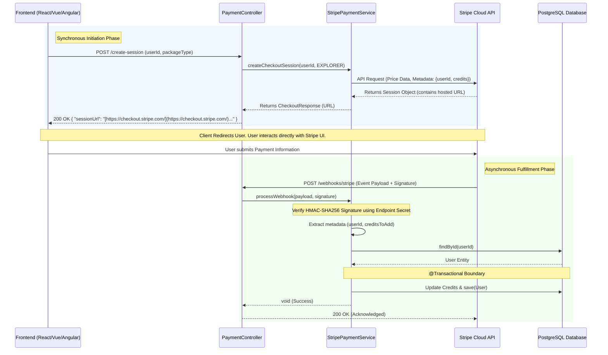

## 1. Architectural Overview

The payment module is designed following a Service-Oriented Architecture (SOA) and the Interface Segregation Principle, ensuring a decoupled and testable integration with the Stripe API. The system utilizes a hosted payment flow to minimize PCI compliance overhead while maintaining robust server-side control over fulfillment.

**Component Responsibilities:**
* **`PaymentController.java`**: Acts as the RESTful entry point. It handles client-side requests to initiate payments and listens for asynchronous "Server-to-Server" notifications (Webhooks) from Stripe.
* **`PaymentService.java` & `StripePaymentServiceImpl.java`**: Follows the Bridge Pattern. The interface defines the business contract, while the implementation orchestrates the Stripe Java SDK. It manages session parameter construction, cryptographic signature verification, and atomic database updates.
* **`CreditPackage.java`**: A Domain-Specific Enum that serves as the single source of truth for pricing. It encapsulates metadata (display names, credit values, and prices in cents) required by both the internal business logic and the external Stripe API.
* **`CheckoutResponse.java`**: A Data Transfer Object (DTO) facilitating a clean contract with the frontend (React/Angular/Vue), returning only the necessary `sessionUrl` for client-side redirection.
* **`testCRUD.http`**: Provides an Integration Specification for developers to exercise the API endpoints using standard HTTP clients directly within the IDE (IntelliJ/VS Code).

---

## 2. Deep-Dive: Stripe API Concepts

Building a scalable payment system requires a deep understanding of how local application state synchronizes with Stripe's distributed global state.

**Core Concepts Utilized:**
* **Checkout Sessions**: A temporary, server-side object representing a customer's intent to pay. We use `Mode.PAYMENT` to signify a one-time transaction. The session handles the secure UI, currency conversion, and card validation entirely on Stripe’s infrastructure.
* **Inline Price Creation**: Instead of hardcoding static Price IDs from the Stripe Dashboard, this implementation dynamically injects `unit_amount` (in cents) and `currency`. This allows the `CreditPackage` enum to drive the pricing model directly from the codebase, preventing configuration drift.
* **Metadata (State Persistence)**: This is the architectural "glue." Because the user leaves our application to pay on Stripe, request context is lost. We inject `userId` and `creditsToAdd` into the Stripe Session's metadata. When Stripe asynchronously notifies us of success, it returns this exact metadata, allowing us to identify the user and fulfill the order without requiring a persistent "Pending Payment" tracking table in our database.
* **Webhooks (Event-Driven Fulfillment)**: Payments are fundamentally asynchronous. A "Success" redirect back to our frontend is only a UI affordance and should **never** trigger database updates. True fulfillment happens when our `/webhooks/stripe` endpoint receives a validated `checkout.session.completed` event.
* **Signature Verification (HMAC-SHA256)**: To prevent Replay Attacks or Malicious Payload Injection, we use the Stripe Webhook Signing Secret. The `Webhook.constructEvent` method cryptographically ensures the payload hasn't been tampered with and authentically originated from Stripe.

---

## 3. Spring Boot Annotations Analysis

| Annotation | Technical Context in Payment Integration |
| :--- | :--- |
| `@RestController` | Marks the `PaymentController` for the Spring `DispatcherServlet`, ensuring response bodies are automatically marshaled into JSON formats for the client. |
| `@Service` | Stereotype that registers `StripePaymentServiceImpl` as a Spring-managed Bean, enabling its injection into the Controller via Inversion of Control (IoC). |
| `@Value` | Used for Externalized Configuration. It injects sensitive keys (`stripe.api.key`) and webhook secrets from `application.properties` or Environment Variables, keeping them secure and out of source control. |
| `@PostConstruct` | A lifecycle hook that executes `Stripe.apiKey` initialization exactly once after the bean is constructed and dependencies injected. This ensures the Stripe SDK is globally configured before any HTTP requests arrive. |
| `@Transactional` | Applied to the webhook processing method. This is critical for **Atomicity**. If the `userRepository.save()` fails (e.g., due to a database timeout), the entire transaction is rolled back, preventing "phantom credits" from being issued if the state cannot be properly persisted. |
| `@Slf4j` | (Lombok) Provides an abstraction over the SLF4J logging framework. Crucial here for maintaining audit trails of payment attempts, metadata mapping, and critical error reporting during webhook payload failures. |
| `@RequestBody` | In the webhook endpoint, it captures the raw JSON `String` payload from Stripe. Reading it as a raw string (rather than an object) is strictly required for the cryptographic signature verification process to succeed. |
| `@RequestHeader` | Extracts the `Stripe-Signature` HTTP header necessary for the HMAC validation. |

---

## 4. Execution Workflow

The communication flow is strictly split into a synchronous **Initiation Phase** and an asynchronous **Fulfillment Phase**.

**Step-by-Step Execution:**
1. **Request**: The client triggers a `POST` to `/api/payments/create-session` passing `userId` and `packageType` (e.g., `EXPLORER`).
2. **Logic**: `PaymentController` delegates to `PaymentService`. The service maps the `EXPLORER` enum to its associated price (e.g., 900 cents) and credit value (e.g., 500).
3. **SDK Call**: `StripePaymentServiceImpl` initiates a synchronous outbound request to the Stripe API to generate a `Session`, embedding the `userId` and `credits` directly into the session `metadata`.
4. **Response**: Stripe returns the generated `sessionUrl`. The service wraps this in a `CheckoutResponse` DTO and returns it to the Controller.
5. **Redirect**: The Controller sends an HTTP 200 JSON response to the Client, which then redirects the user's browser to the Stripe hosted URL.
6. **Payment**: The user inputs payment details securely on Stripe's domain.
7. **Webhook**: Upon a successful charge, Stripe's backend sends an asynchronous `POST` request to our server's `/webhooks/stripe` endpoint containing the event payload and signature header.
8. **Verify**: The backend verifies the HMAC signature. Once validated, it parses the attached metadata (`userId: 1`, `credits: 500`).
9. **Fulfill**: Inside a `@Transactional` block, the backend queries the `User` entity by ID, increments their credit balance, and commits the transaction to the PostgreSQL database.
10. **Acknowledge**: The backend returns an HTTP 200 OK to Stripe to acknowledge receipt and halt further webhook retries.

**Sequence Diagram:**

---

## 5. Rendering Note
> **Note to Developers:** To properly visualize the Mermaid.js sequence diagram above, please use a Markdown viewer that supports Mermaid syntax natively. Recommended tools include the GitHub/GitLab web interfaces, or VS Code with the **Markdown Preview Mermaid Support** extension enabled.